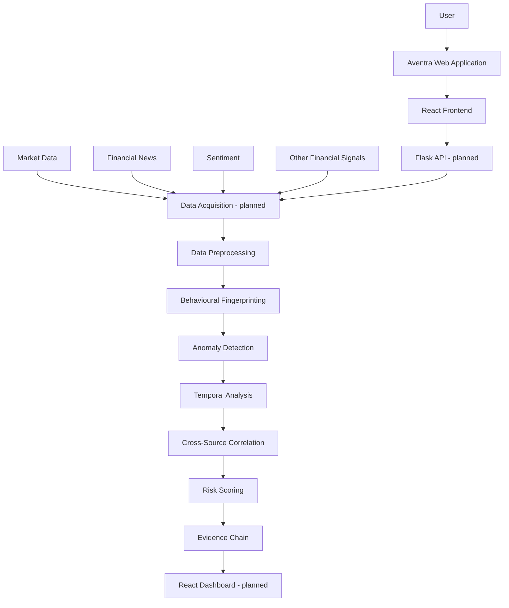
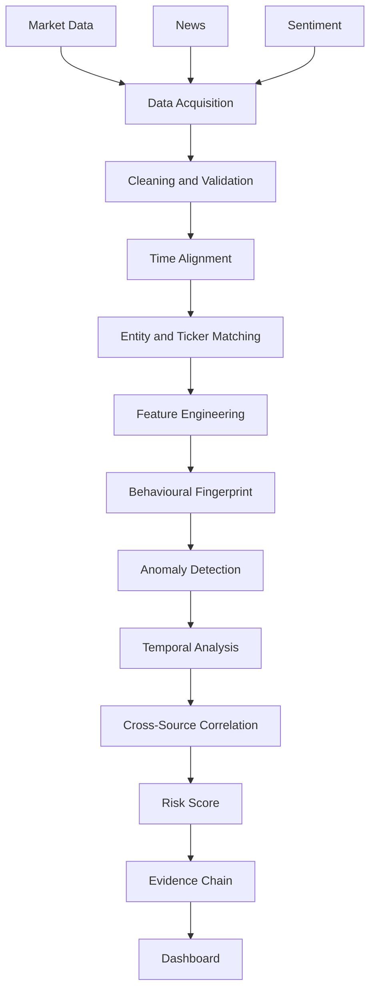

# Aventra

> **Detect Hidden Patterns. Understand Market Risk.**

Aventra is an AI-powered financial-market intelligence project focused on adaptive behavioural fingerprinting, anomaly detection, multi-source analysis, temporal patterns, and explainable risk insights. The repository currently delivers Aventra's responsive React landing page; its Flask API, data integrations, and ML pipeline are planned future work.

## 1. Overview

Financial-market observations are rarely meaningful in isolation. A price movement can be better understood alongside an asset's historical behaviour, timing, related news, sentiment, and other contextual signals. Aventra explores an approach that treats these signals as connected evidence rather than as independent alerts.

Its central concept, **behavioural fingerprinting**, is an asset-specific baseline of historically observed behaviour. The planned system will use this baseline, temporal relationships, and multi-source signals to surface unusual patterns and communicate the context behind a risk indicator. Aventra does not claim to predict markets, guarantee detection, or provide investment advice.

## 2. Objectives

- Identify unusual financial-market behaviour.
- Develop adaptive behavioural profiles for individual assets. *(Planned)*
- Combine market, news, sentiment, and related financial signals. *(Planned)*
- Incorporate temporal relationships between observations and events. *(Planned)*
- Analyse financial news and sentiment as contextual signals. *(Planned)*
- Generate interpretable risk indicators. *(Planned)*
- Provide an evidence-oriented view of detected anomalies. *(Planned)*

## 3. Current Status

| Component | Status |
|---|---|
| React frontend | Implemented |
| Landing page | Implemented |
| Responsive UI | Implemented |
| Tailwind styling | Implemented |
| Logo integration | Implemented (navbar) |
| Dashboard UI | Planned / In progress |
| Flask API | Planned |
| Market-data integration | Planned |
| Behavioural fingerprinting engine | Planned / In development |
| Anomaly detection engine | Planned / In development |
| News analysis | Planned / In development |
| Evidence-chain engine | Planned / In development |

The landing page includes an illustrative market-data panel. Its data is intentionally labelled as demo data and is supplied through a replaceable frontend service adapter; it is not live market data.

## 4. Features

The following are Aventra's core planned capabilities. The current implementation presents them in the landing-page UI only.

### 4.1 Adaptive Behavioural Fingerprinting

Create an asset-specific representation of historically observed behaviour, then compare new observations with that context to help identify deviations. Algorithm choice, thresholds, and evaluation results will be defined after implementation and experimentation.

### 4.2 AI Financial News Analysis

Analyse financial news and related textual signals for unusual or relevant context. This does not imply definitive detection of AI-generated content; any such classification would require a separately implemented and validated model.

### 4.3 Multi-Source Anomaly Detection

Combine signals from different financial sources rather than treating any single metric as conclusive. Source selection and data-quality controls are planned.

### 4.4 Cross-Source Event Correlation

Relate market movements to nearby news, sentiment changes, and temporal events to create context for an observation.

### 4.5 Risk Scoring and Evidence Chain

Present an interpretable risk signal with the evidence that contributed to it. The scoring model and evidence representation are planned, not yet implemented.

## 5. Technology Stack

| Area | Technology | Status |
|---|---|---|
| Frontend | React 19 | Implemented |
| Frontend | TypeScript | Implemented |
| Frontend | Vite | Implemented |
| Styling | Tailwind CSS v4 with `@tailwindcss/vite` | Implemented |
| Icons | Lucide React | Implemented |
| Backend | Flask / Python | Planned |
| AI/ML | Python, model and NLP libraries to be selected | Planned |
| Data | Market, financial-news, sentiment, and other financial signals | Planned |

## 6. Project Architecture

The implemented frontend is deliberately separated from the future API through `src/services/marketApi.ts`. When the backend is introduced, the intended architecture is:

```text
User → React Frontend → Flask REST API → Data Processing → AI/ML Analysis
     → Anomaly Detection → Risk Scoring → Evidence Chain → React Dashboard
```

Only the React frontend and its local demo adapter currently exist. Every backend, processing, analysis, and dashboard item in this flow is planned.

## 7. High-Level Design (HLD)



- **React Frontend:** current landing page and future dashboard presentation layer.
- **Flask API:** planned boundary between the browser and server-side data/analysis services.
- **Data acquisition and preprocessing:** planned ingestion, validation, normalization, and alignment of source data.
- **Analysis pipeline:** planned fingerprinting, anomaly, temporal, correlation, and risk modules.
- **Evidence chain:** planned explanation layer that associates an indicator with its supporting observations.

## 8. Low-Level Design (LLD)

### Implemented frontend hierarchy

```text
App
├── Navbar
├── Home
│   ├── Hero
│   ├── AboutAventra
│   ├── LiveMarketData
│   ├── Services
│   ├── HowItWorks
│   ├── WhyAventra
│   └── Contact
└── Footer
```

`App.tsx` composes the global navigation, page, and footer. `Home.tsx` composes landing-page sections. Shared controls and headings live in `components/common`; service-card presentation is isolated in `components/services`; data and the demo market adapter remain outside view components.

### Planned backend modules

```text
routes/
├── market_routes
├── news_routes
├── analysis_routes
├── anomaly_routes
└── contact_routes

services/
├── market_service
├── news_service
├── sentiment_service
├── fingerprint_service
├── anomaly_service
├── temporal_service
├── correlation_service
├── risk_service
└── evidence_service
```

These directories do not currently exist. They describe a progressive future Flask design in which routes validate and expose requests, while services implement data access and analytical responsibilities.

## 9. Frontend Architecture

The actual frontend structure is intentionally component-oriented:

- `components/common`: reusable `Navbar`, `Footer`, `Button`, and `SectionHeading` components.
- `components/home`: the seven landing-page section components.
- `components/services`: reusable service-card presentation.
- `pages/Home.tsx`: page composition.
- `data/services.ts`: service-card content and icon metadata, separated from rendering.
- `services/marketApi.ts`: data-source abstraction. It currently returns labelled demo data and is the intended replacement point for `GET /api/market-data`.
- `styles/index.css`: global design tokens, responsive rules, scroll snapping, and component styling, with Tailwind CSS v4 imported at the top.

## 10. Logo and Brand Asset Integration

The navbar uses the project asset [`frontend/src/assets/short-logo.png`](frontend/src/assets/short-logo.png), imported by `src/components/common/Navbar.tsx` and rendered as an image with `alt="Aventra"`. The full brand asset is also present at [`frontend/src/assets/logo.png`](frontend/src/assets/logo.png).

Using an image asset preserves the supplied brand mark rather than recreating it as plain text. PNG is the current repository format; SVG would generally be preferable for a scalable logo if a suitable source asset becomes available. The repository also contains [`frontend/public/favicon.svg`](frontend/public/favicon.svg), referenced by `frontend/index.html`. The footer currently uses a textual wordmark.

## 11. UI/UX Design System

| Role | Color |
|---|---|
| Primary background | `#101B20` |
| Secondary background | `#1B2A30` |
| Primary text | `#F5F7F8` |
| Secondary text | `#AAB4B8` |
| Cyan / teal accent | `#62D6D0` |
| Bright cyan | `#72E6E0` |
| Orange CTA | `#F5A623` |
| Bright orange | `#FFB52E` |
| Border | `#304148` |

The visual hierarchy moves from dark surfaces to high-contrast typography, then uses cyan for technical/data emphasis and orange for calls to action and selected highlights. Manrope provides the primary UI typeface; DM Mono is used for compact technical labels. The interface uses generous spacing, thin borders, restrained hover elevation, keyboard-visible focus states, semantic elements, form labels, and responsive layouts. Sections fill the viewport and snap vertically on desktop; snapping is softened on mobile to protect readability.

## 12. Landing Page Structure

1. **Navbar** — brand mark, anchor navigation, search affordance, CTA, and mobile menu.
2. **Home / Hero** — Aventra positioning, primary/secondary actions, and supplied visual artwork.
3. **About Aventra** — conceptual overview, supplied analysis illustration, and capability summary.
4. **Live Market Data** — clearly marked demo market panel behind the API abstraction.
5. **Our Services** — the five core capability cards.
6. **How It Works** — visual workflow centred on behavioural fingerprinting.
7. **Why Aventra** — compact adaptive, temporal, contextual, and explainable principles.
8. **Contact** — compact form and project location.
9. **Footer** — tagline, navigation, and copyright.

The hero tagline is: **“Detect Hidden Patterns. Understand Market Risk.”**

## 13. Data Flow

This is the **planned** analytical pipeline, not a currently running implementation.



The flow highlights where source quality, time alignment, entity matching, model selection, and explanation will matter. It does not prescribe a final algorithm or imply validated performance.

## 14. API Design

The following Flask REST endpoints are **planned only**. No Flask server or live endpoint is present in this repository.

| Method and route | Purpose | Request | Illustrative response |
|---|---|---|---|
| `GET /api/market-data` | Retrieve normalized selected-market data | Optional asset/query parameters | Asset metadata, metrics, and time series |
| `GET /api/news` | Retrieve linked financial news context | Asset, time range, pagination | News records and source metadata |
| `POST /api/analyze` | Start or request contextual analysis | Asset and analysis parameters | Analysis job/result reference |
| `POST /api/anomaly` | Evaluate a supplied or selected observation | Observation or asset/time range | Candidate anomaly indicator and context |
| `GET /api/evidence/:id` | Retrieve supporting evidence for an indicator | Evidence identifier | Features, linked events, and provenance |

Request schemas, authentication, pagination, error formats, rate limits, and response contracts will be defined with the backend implementation. Browser-side source scraping is not an intended design.

## 15. AI/ML Pipeline

The intended workflow is:

```text
Data Collection → Preprocessing → Feature Engineering → Baseline Models
→ Anomaly Detection → Temporal Modelling → Cross-Source Analysis
→ Risk Scoring → Explainability
```

Model families, features, training procedures, evaluation datasets, metrics, thresholds, and results are deliberately not specified as implemented. They should be documented only after experimentation.

## 16. Behavioural Fingerprinting

Behavioural fingerprinting is Aventra's central planned concept. Rather than using one global expectation for every asset, it aims to establish an asset-specific historical baseline across multiple behavioural dimensions. New observations can then be considered as potential deviations, including how they evolve in time and whether related contextual signals exist. This is a conceptual design; no final equations or production model are represented in the repository.

## 17. Explainability / Evidence Chain

The planned explanation layer has two complementary levels:

- **Feature-level explanation:** which observed feature or change contributed to an indicator?
- **Event-level explanation:** how did abnormal behaviour develop across time and sources?

An evidence chain is intended to connect a detected indicator with supporting observations and source context. It does not guarantee causal conclusions.

## 18. Directory Structure

### Current structure

```text
Aventra/
├── readme.md
└── frontend/
    ├── README.md
    ├── eslint.config.js
    ├── index.html
    ├── package.json
    ├── package-lock.json
    ├── vite.config.ts
    ├── tsconfig.json
    ├── public/
    │   ├── favicon.svg
    │   └── icons.svg
    └── src/
        ├── App.tsx
        ├── App.css
        ├── main.tsx
        ├── vite-env.d.ts
        ├── assets/
        │   ├── about.png
        │   ├── hero page.png
        │   ├── hero-shadow.png
        │   ├── hero.png
        │   ├── logo.png
        │   ├── short-logo.png
        │   ├── react.svg
        │   └── vite.svg
        ├── components/
        │   ├── common/
        │   ├── home/
        │   └── services/
        ├── data/services.ts
        ├── pages/Home.tsx
        ├── services/marketApi.ts
        └── styles/index.css
```

### Planned structure

Flask routes, backend services, data-processing modules, model code, test suites, and dashboard-specific functionality are not yet present.

## 19. Installation

Use a local clone of this repository; no repository URL is specified here.

```bash
cd Aventra
cd frontend
npm install
npm run dev
```

Vite prints the local development URL after startup. A current Node.js LTS release is recommended for the Vite toolchain.

## 20. Tailwind CSS Setup

The project uses Tailwind CSS v4 with Vite integration:

- `tailwindcss` and `@tailwindcss/vite` are installed in `frontend/package.json`.
- `frontend/vite.config.ts` registers `tailwindcss()` alongside the React plugin.
- `frontend/src/styles/index.css` imports Tailwind using `@import "tailwindcss";`.

This is the Tailwind v4 integration, not the older Tailwind v3 configuration pattern.

## 21. Development

Run these commands from `frontend/`:

| Command | Description |
|---|---|
| `npm run dev` | Start the Vite development server |
| `npm run build` | Create a production build |
| `npm run preview` | Preview the production build |
| `npm run lint` | Run the configured ESLint command |

## 22. Testing

No automated test suite is currently configured. Current frontend validation should include manual desktop, tablet, and mobile checks; keyboard navigation; focus visibility; section navigation; asset-path verification; and a production build.

When the backend exists, add API contract and integration tests. When ML components exist, document evaluation datasets, methodology, metrics, false-positive/false-negative analysis, and reproducibility details.

## 23. Environment Variables

No environment variables are currently required by the frontend. A future API integration may use the following optional convention:

| Variable | Status | Purpose |
|---|---|---|
| `VITE_API_BASE_URL` | Planned | Base URL for a Flask API; never store secrets in a `VITE_` variable |

Do not commit API keys, tokens, or other secrets. Public frontend environment variables must be treated as browser-visible.

## 24. Future Development

1. Landing page — implemented.
2. Dashboard — planned.
3. Flask API — planned.
4. Market/news integrations — planned.
5. Behavioural fingerprinting — planned.
6. Anomaly detection — planned.
7. Cross-source correlation — planned.
8. Risk scoring and evidence chain — planned.
9. Evaluation and deployment — planned.

## 25. Research Context

Aventra is being developed as a B.Tech final-year research and development project at ABES Engineering College, Ghaziabad, Uttar Pradesh, India. Its research context includes financial-market anomaly detection, behavioural fingerprinting, multimodal/multi-source signals, temporal modelling, and explainability. No publication or experimental result is claimed in this repository.

## 26. Contribution

Aventra explores an integrated framework for analysing financial market behaviour by combining adaptive behavioural profiling, anomaly detection, temporal relationships, and contextual evidence. The project contribution is exploratory and must be evaluated through future implementation and experimentation.

## 27. Limitations

- The repository currently provides frontend UI only; no live data, API, ML model, or dashboard is implemented.
- Future results will depend on data availability, source quality, timestamp alignment, missing observations, and entity/ticker matching.
- Any anomaly model may produce false positives or false negatives and will depend on its training/validation data and chosen thresholds.
- Evidence and explainability outputs may be incomplete or limited by source coverage.
- Third-party data and API availability, permissions, licensing, and rate limits may constrain integrations.

## 28. License

License to be determined.

## 29. Author / Project Information

Developed as a B.Tech Final Year Project  
ABES Engineering College  
Ghaziabad, Uttar Pradesh, India
