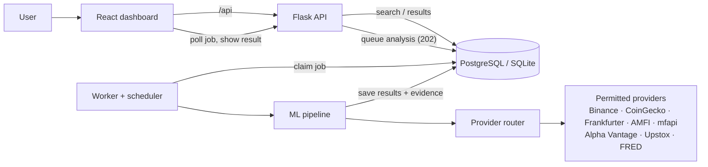
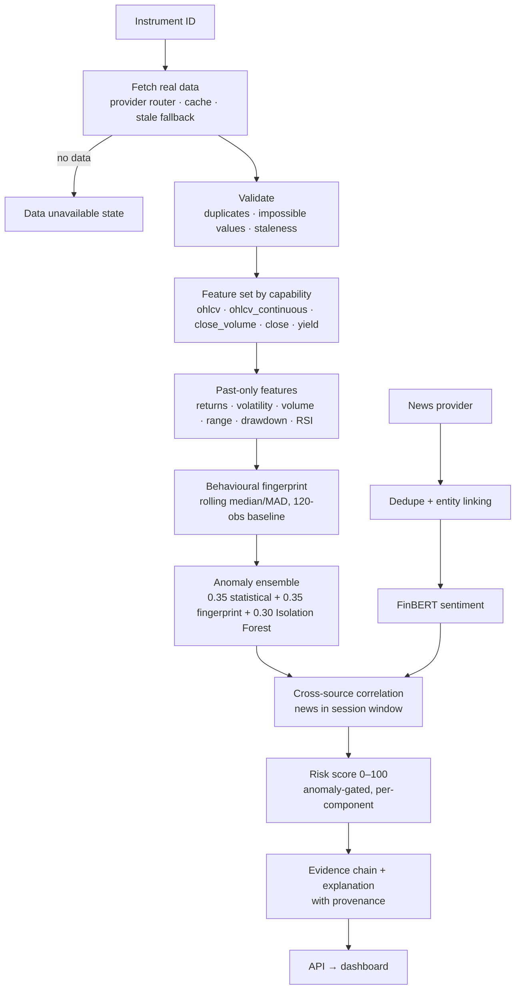

# Aventra

<p align="center">
  
</p>

<p align="center"><b>Detect Hidden Patterns. Understand Market Risk.</b></p>

Aventra is an explainable financial-intelligence platform. It detects unusual market behaviour, links it to news sentiment and explains *what changed, how unusual it is, what else happened and why it was flagged*. It does not predict prices or give financial advice, and it never fabricates data: when real data is unavailable it says so.

B.Tech final-year project — ABES Engineering College, Ghaziabad, India.

<p align="center">
  <a href="./Aventra.mp4"><strong>▶ Watch the Aventra demo</strong></a>
</p>

## What is implemented

| Area | Status |
|---|---|
| Instrument search (~68,600 instruments, canonical IDs like `XNAS:AAPL`, `CRYPTO:BTC-USDT`) | ✅ Implemented |
| Crypto, forex, Indian mutual funds (Binance, CoinGecko, Frankfurter/ECB, AMFI, mfapi) | ✅ Works without API keys |
| US/BSE/NSE equities, ETFs, REITs, InvITs, bonds, indices, rates (Alpha Vantage, Upstox, FRED) | 🔑 Implemented, needs provider key |
| News + FinBERT sentiment (Alpha Vantage NEWS_SENTIMENT) | 🔑 Implemented, needs key; no Indian news source |
| Behavioural fingerprint, anomaly ensemble, correlation, risk, evidence chain | ✅ Implemented (weights uncalibrated) |
| PostgreSQL/SQLite + Alembic, background job queue + worker | ✅ Implemented |
| React frontend (design-spec redesign: search, intelligence workspace, About/Research/Docs/Contact, lazy 3D) | ✅ Implemented |
| Docker Compose (postgres, backend, worker, frontend) | ✅ Verified |
| Evaluation | ⚠️ Partial — synthetic injection on real data (EXP-03) |
| CI, real-event benchmark | ❌ Not implemented |

## System flow


```mermaid
flowchart LR
    U["User"] --> FE["React dashboard"]
    FE -->|"/api"| API["Flask API"]
    API -->|"search / results"| DB[("PostgreSQL / SQLite")]
    API -->|"queue analysis (202)"| DB
    W["Worker + scheduler"] -->|"claim job"| DB
    W --> ML["ML pipeline"]
    ML --> P["Provider router"]
    P --> EXT["Permitted providers<br/>Binance · CoinGecko · Frankfurter · AMFI · mfapi<br/>Alpha Vantage · Upstox · FRED"]
    ML -->|"save results + evidence"| DB
    FE -->|"poll job, show result"| API
```

## ML pipeline


```mermaid
flowchart TD
    A["Instrument ID"] --> B["Fetch real data<br/>provider router · cache · stale fallback"]
    B -->|"no data"| X["Data unavailable state"]
    B --> C["Validate<br/>duplicates · impossible values · staleness"]
    C --> D["Feature set by capability<br/>ohlcv · ohlcv_continuous · close_volume · close · yield"]
    D --> E["Past-only features<br/>returns · volatility · volume · range · drawdown · RSI"]
    E --> F["Behavioural fingerprint<br/>rolling median/MAD, 120-obs baseline"]
    F --> G["Anomaly ensemble<br/>0.35 statistical + 0.35 fingerprint + 0.30 Isolation Forest"]
    N1["News provider"] --> N2["Dedupe + entity linking"] --> N3["FinBERT sentiment"]
    G --> H["Cross-source correlation<br/>news in session window"]
    N3 --> H
    H --> I["Risk score 0–100<br/>anomaly-gated, per-component"]
    I --> J["Evidence chain + explanation<br/>with provenance"]
    J --> K["API → dashboard"]
```

Details and formulas: [docs/05_ML_PIPELINE.md](docs/05_ML_PIPELINE.md).

## Tech stack

| Layer | Technologies |
|---|---|
| Frontend | React 19, TypeScript, Vite 8, Tailwind CSS v4, lucide-react, Vitest |
| Backend | Python 3.12, Flask 3, SQLAlchemy 2, Alembic, psycopg 3, gunicorn |
| ML / NLP | pandas, NumPy, scikit-learn (Isolation Forest, LOF), PyTorch, Transformers (FinBERT), sentence-transformers, ruptures, exchange_calendars |
| Database | PostgreSQL 16 (Docker), SQLite (local/tests) |
| Deployment | Docker Compose, nginx |

## Run it

**Docker:**

```bash
cp .env.example .env        # set POSTGRES_PASSWORD; add provider keys if you have them
docker compose up --build   # UI http://localhost:8080 · API http://localhost:5050/api/health
```

**Local:**

```powershell
py -3.12 -m pip install -r backend/requirements.txt
py -3.12 -m ml.instruments.sync     # build the instrument list
py -3.12 -m backend.app             # API http://127.0.0.1:5000
cd frontend; npm install; npm run dev   # UI http://localhost:5173
```

FinBERT weights go in `backend/models/finbert/`. More options: [docs/21_DEPLOYMENT.md](docs/21_DEPLOYMENT.md).

## Tests

```bash
py -3.12 -m unittest discover -s ml/tests -t .        # 73 passed (1 PostgreSQL-only skipped)
py -3.12 -m unittest discover -s backend/tests -t .   # 25 passed
cd frontend && npm test                                # 39 passed
```

## Limitations

- Without keys, only crypto, forex and Indian mutual funds can be analysed.
- No permitted news source for Indian equities.
- Weights and thresholds are uncalibrated defaults. In EXP-03 the ensemble is not always the best detector ([docs/17](docs/17_MODEL_EVALUATION.md)).
- Daily data only; futures and US mutual funds are not supported.

Full list: [docs/25_LIMITATIONS.md](docs/25_LIMITATIONS.md).

## Documentation

[Architecture](docs/04_SYSTEM_ARCHITECTURE.md) · [ML pipeline](docs/05_ML_PIPELINE.md) · [Providers](docs/06_DATA_SOURCES_AND_PROVIDERS.md) · [API](docs/14_API_SPECIFICATION.md) · [Evaluation](docs/17_MODEL_EVALUATION.md) · [Testing](docs/19_TESTING.md) · [Deployment](docs/21_DEPLOYMENT.md) · [Limitations](docs/25_LIMITATIONS.md) · [Status & rules](AGENTS.md)

## License

To be determined. Provider data remains under each provider's terms.
